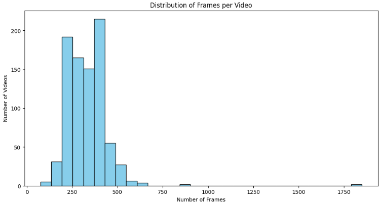
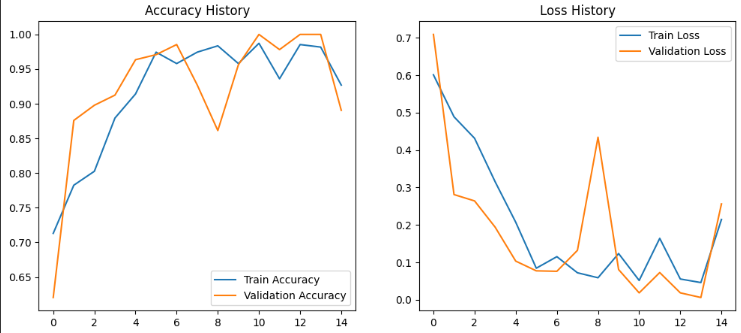
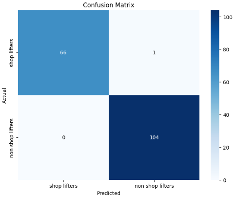

---

## 📜 Table of Contents

- [About The Dataset](#-about-the-dataset)
- [Model Architecture](#-model-architecture)
- [Getting Started](#-getting-started)
  - [Prerequisites](#prerequisites)
  - [Installation](#installation)
- [Usage](#-usage)
- [Results](#-results)
- [Contributing](#-contributing)
- [License](#-license)

---

## 📊 About The Dataset

The model was trained on a custom dataset of videos categorized into two classes: "shoplifters" and "non-shoplifters." The dataset contains a variety of scenarios to ensure the model's robustness. The distribution of frames per video is as follows:



---

## 🧠 Model Architecture

The core of this project is a hybrid CNN-RNN model designed for video classification:

-   **CNN Base (MobileNetV2):** A pre-trained MobileNetV2 is used for efficient feature extraction from individual video frames.
-   **TimeDistributed Layer:** This wrapper allows the CNN to process each frame of a video sequence independently.
-   **GRU (Gated Recurrent Unit) Layer:** A GRU layer processes the sequence of features to capture temporal dependencies and patterns in the video.
-   **Dense Layers:** Fully connected layers at the end classify the video as either containing shoplifting activity or not.

The best-performing model weights are saved in the `best_ShopGuard_model.h5` file.

---

## 🚀 Getting Started

To get a local copy up and running, follow these simple steps.

### Prerequisites

You will need Python 3.x and the following libraries:

-   TensorFlow
-   OpenCV
-   scikit-learn
-   Matplotlib
-   NumPy

### Installation

1.  Clone the repo
    ```sh
    git clone https://github.com/your_username/ShopGuard.git
    ```
2.  Install Python packages
    ```sh
    pip install tensorflow opencv-python scikit-learn matplotlib numpy
    ```

---

## 🏃‍♀️ Usage

All the code for data preprocessing, model training, and evaluation is contained within the **`ShopGuard.ipynb`** Jupyter Notebook.

You can run the notebook in a Jupyter or Google Colab environment to see the entire workflow. The notebook also includes the code to load the pre-trained model (`best_ShopGuard_model.h5`) for inference.

---

## 📈 Results

The model achieves an outstanding accuracy of approximately **99.42%** on the test set. The detailed performance metrics are visualized below.

### Accuracy and Loss History

The training history shows that the model learns effectively, with the validation accuracy tracking the training accuracy closely and the validation loss decreasing consistently.



### Confusion Matrix

The confusion matrix demonstrates the model's excellent performance in distinguishing between the two classes, with very few misclassifications.



---

## 🙌 Contributing

Contributions are what make the open-source community such an amazing place to learn, inspire, and create. Any contributions you make are **greatly appreciated**.

1.  Fork the Project
2.  Create your Feature Branch (`git checkout -b feature/AmazingFeature`)
3.  Commit your Changes (`git commit -m 'Add some AmazingFeature'`)
4.  Push to the Branch (`git push origin feature/AmazingFeature`)
5.  Open a Pull Request

---

## 📄 License

Distributed under the MIT License. See `LICENSE` for more information.
